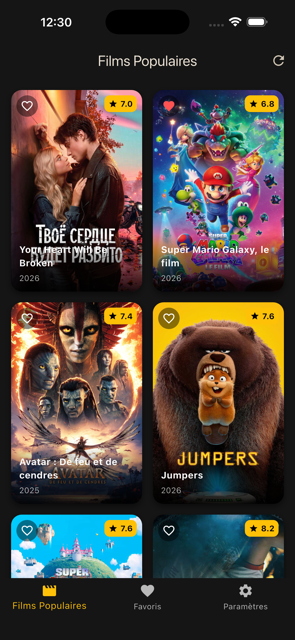
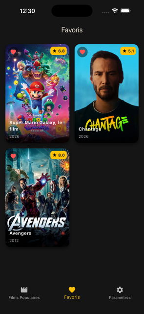
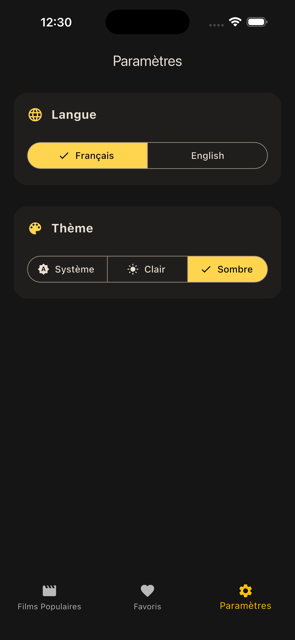

# Movie Explorer

Cibles supportées : Web, iOS, Android.

Validé sur Web & iOS.





## Fonctionnalités Principales

- Films Populaires : Défilement avec pagination automatique.
- Favoris : Sauvegarde des films pour consultation hors-ligne avec base de données locale.
- Thème : Choix entre Mode Sombre, Mode Clair ou détection du système.
- Internationalisation (i18n) : Prise en charge du Français et de l'Anglais, avec sauvegarde des préférences de langue.
- Stratégie Cache : Conservation locale des images et persistance des requêtes API pour une consultation sans réseau.
- Accessibilité : Implémentation simple compatible VoiceOver/TalkBack.

## Architecture & Choix Techniques

L'application repose sur la Clean Architecture afin de conserver une séparation des responsabilités :

1. Couche Domain (lib/domain/) : Contient les entités métiers (ex: Movie), les interfaces de Repositories, et les Use Cases ayant une seule responsabilité métier (ex: GetPopularMoviesUseCase). Ne contient aucune dépendance liée à Flutter ou aux frameworks externes.
2. Couche Data (lib/data/) : Responsable de l'implémentation. Elle exécute et route les requêtes réseaux ou interroge la base locale. Cette séparation permet d'interchanger les sources de données sans impacter la logique métier.
3. Couche Presentation (lib/presentation/) : Gère l'interface utilisateur et s'abonne aux changements d'état poussés par la couche métier.

### Sélections Techniques :

- Gestion d'état (BLoC) : L'utilisation de flutter_bloc gère l'état de chaque fonctionnalité de façon isolée (FavoritesBloc, PopularMoviesBloc, SettingsBloc). Cela permet de séparer formellement les évènements de l'interface des données générées.
- Service Locator (GetIt) : L'initialisation asynchrone des UseCases et Repositories est isolée dans un localisateur. Ce choix évite d'alourdir l'arbre de Context Flutter et favorise une configuration de tests isolés.
- Networking (Dio & Retrofit) : Application conjointe de Dio et Retrofit pour isoler, sérialiser et typer les appels HTTP (JSON to Dart).
- Persistance & Séparation du Cache :
  - Sqflite : Exclusivement dédié aux données relationnelles générées par l'utilisateur (Sauvegarde des Favoris et Paramètres). L'ajout de sqflite_common_ffi_web garantit l'interfaçage sur le navigateur.
  - Dio Cache Interceptor : Intercepte nativement les flux API. En cas de coupure de réseau, l'application substitue la réponse attendue par celle stockée dans le cache.
  - Image Cache : Utilisation de cached_network_image pour la restitution locale des posters.
- UI : L'enregistrement du ScaffoldMessenger et des thèmes directement dans le bloc du MaterialApp permet le renvoi d'événements et de Snackbars d'information sans passage manuel du contexte de routage.

### Notes

Dans le pragmatisme d'un test technique, certains raccourcis ont été consentis :
- **Variables d'Environnement** : Les jetons d'API (TMDB) sont déclarés localement et publiquement, sans mécanisme industriel d'obscurcissement CI/CD.
- **Tests** : Bien que présente pour la demarche, la suite unitaire cible simplement la validation des structures (Domain, Blocs, Remotes) sans chercher une couverture sensée ou utile.

## Lancement & Installation

1. Récupérer les dépendances :
   ```bash
   flutter pub get
   ```

2. Régénérer le code :
   ```bash
   flutter gen-l10n
   flutter pub run build_runner build --delete-conflicting-outputs
   ```

3. Lancement (exemple Web) :
   ```bash
   flutter run -d chrome
   ```

4. Exécuter les tests unitaires natifs :
   ```bash
   flutter test
   ```

## Stack Technique
- State Management : flutter_bloc
- Networking : dio, retrofit
- Base de Données / Persistance : sqflite
- Système de Cache : dio_cache_interceptor, cached_network_image
- L10N : flutter_localizations

Ce projet a été construit avec l'aide d'outils IA.